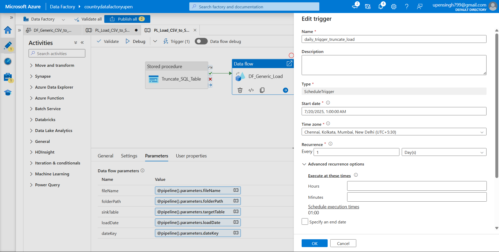
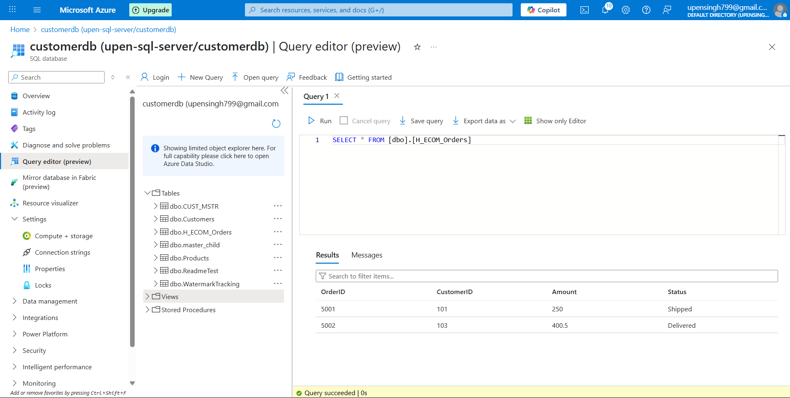

# Azure Data Factory Project: Dynamic CSV to Azure SQL Pipeline

## Overview

This Azure Data Factory (ADF) project dynamically ingests CSV files from Azure Data Lake Storage (ADLS) and loads them into Azure SQL Database using parameterized pipelines and mapping data flows. The pipeline includes truncate-and-load logic and is scheduled to run daily at 1:00 AM.

---

## Features

- Parameterized dataset to dynamically handle different files and tables  
- Mapping Data Flow to extract, transform, and load (ETL) data  
- Stored procedure activity to truncate target SQL tables before loading  
- Daily scheduled trigger to run the pipeline automatically  
- Scalable and reusable pipeline design

---

## Sample CSV Files

Sample files are stored in the **`rawzone` container** of ADLS Gen2 with filenames that follow this format:

```
<TableName>_<yyyymmdd>.csv
```

### Example Files:
- `CUST_MSTR_20191112.csv`
- `CUST_MSTR_20191113.csv`
- `H_ECOM_ORDER_20191112.csv`
- `master_child_export-20191112.csv`

Each file has headers and uses comma (`,`) as a delimiter. Schema is inferred from the file during data flow execution.

---

## Data Flow: `DF_Generic_CSV_to_SQL`

### Functionality:

- **Source**: Reads CSV file from ADLS with dynamic parameters  
- **Derived Column**: Extracts `load_date` from the filename  
- **Sink**: Loads data into the SQL table passed via parameter

### Screenshot of Data Flow Design  
---


---


## Pipeline: `PL_Load_CSV_to_SQL_Tables`

### Activities:

1. **Stored Procedure Activity**: Truncates the target table  
2. **Mapping Data Flow Activity**: Loads transformed data into Azure SQL

### Screenshot of Pipeline Design  
---


### Screenshot of Pipeline Run Output  
---


---

## Truncate Logic (Stored Procedure Activity)

Before loading new data, the pipeline truncates the destination table using a stored procedure called `sp_truncate_table`.

### Stored Procedure Sample:
```sql
CREATE PROCEDURE sp_truncate_table
    @table_name NVARCHAR(128)
AS
BEGIN
    DECLARE @sql NVARCHAR(MAX)
    SET @sql = 'TRUNCATE TABLE ' + QUOTENAME(@table_name)
    EXEC sp_executesql @sql
END
```

### JSON Code for Truncate Activity:

```json
{
    "name": "Truncate_SQL_Table",
    "type": "SqlServerStoredProcedure",
    "typeProperties": {
        "storedProcedureName": "sp_truncate_table",
        "storedProcedureParameters": {
            "table_name": {
                "value": {
                    "value": "@pipeline().parameters.targetTable",
                    "type": "Expression"
                },
                "type": "String"
            }
        }
    },
    "linkedServiceName": {
        "referenceName": "AzureSqlDatabase1",
        "type": "LinkedServiceReference"
    }
}
```

---

## Daily Trigger: `Daily_1AM_Trigger`

This pipeline is automated to run every day at **1:00 AM IST** using a Schedule Trigger.

### Trigger Configuration:
- **Type**: Schedule  
- **Frequency**: Daily  
- **Time**: 1:00 AM IST  
- **Time Zone**: UTC+5:30  

### Screenshot of Trigger Configuration  
---


---

## Folder Structure

```
project/
├── pipeline/
│   └── PL_Load_CSV_to_SQL_Tables.json
├── dataflow/
│   └── DF_Generic_CSV_to_SQL.json
├── sql/
│   └── sp_truncate_table.sql
├── triggers/
│   └── Daily_1AM_Trigger.json
├── sample-data/
│   └── CUST_MSTR_20191112.csv
├── README.md
```

---

## Result

| Table Name           | Screenshot                      |
|----------------------|----------------------------------|
| `CUST_MSTR`          |  |
| `H_ECOM_ORDER`       |  |
| `master_child_export`|  |


## Notes

- This solution supports multiple CSVs and destination tables with just one pipeline.  
- Truncate step ensures clean loading every time.  
- Schedule ensures automation with no manual intervention.

